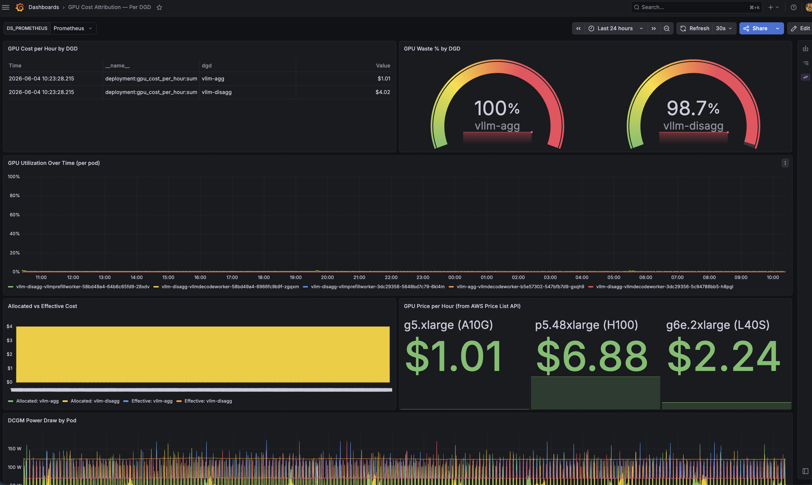
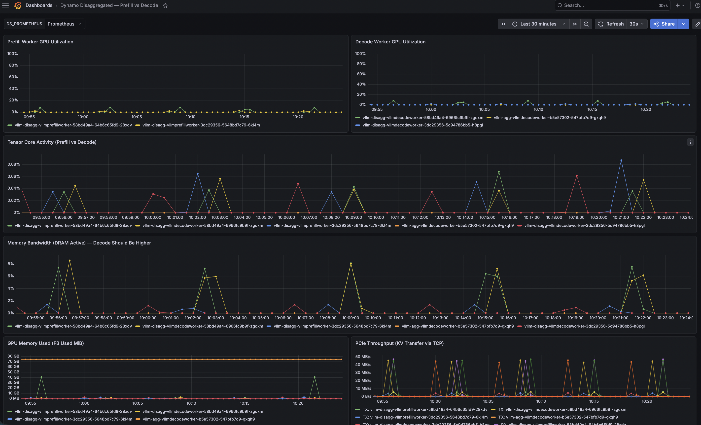

# GPU Cost Attribution for Disaggregated LLM Inference on EKS

*How to track per-team GPU spend when running NVIDIA Dynamo + vLLM on Kubernetes — with real-time AWS pricing, waste detection, and Grafana dashboards you can deploy in 20 minutes.*

---

## The Problem

Your company runs LLM inference on a shared GPU cluster. Multiple teams deploy models. The bill arrives: $47,000/month for GPU instances.

Now answer these questions:

- Which team is spending how much?
- Are GPUs actually working or sitting idle?
- Is disaggregated serving (prefill/decode split) worth the extra GPU?
- Should we right-size GPU allocations?

You can't answer any of this from AWS Cost Explorer. EC2 bills by instance, not by workload. Kubernetes resource requests tell you what's *allocated*, not what's *utilized*. And `nvidia-smi` doesn't know which pod owns which GPU.

This article walks through building a complete GPU cost attribution pipeline on EKS — from raw hardware telemetry to dollar-per-team-per-hour dashboards.

---

## Architecture

```
┌─────────────────────────────────────────────────────────────────────────┐
│  EKS Cluster (Auto Mode)                                                │
│                                                                         │
│  ┌─────────────────────────────────────────────────────────────────┐   │
│  │  NVIDIA Dynamo Platform                                          │   │
│  │                                                                  │   │
│  │  DGD: vllm-disagg (Team Alpha)     DGD: vllm-agg (Team Beta)   │   │
│  │  ┌──────────┐ ┌────────┐ ┌────┐   ┌──────────┐ ┌────────────┐ │   │
│  │  │ Frontend │ │Prefill │ │Dec.│   │ Frontend │ │  Worker    │ │   │
│  │  │ (router) │ │(GPU)   │ │(GPU│   │ (router) │ │  (GPU)     │ │   │
│  │  └────┬─────┘ └───┬────┘ └─┬──┘   └────┬─────┘ └────────────┘ │   │
│  │       └────────────┴────────┘            └──────────────────────┘   │
│  └─────────────────────────────────────────────────────────────────┘   │
│                                                                         │
│  ┌─────────────────────────────────────────────────────────────────┐   │
│  │  Observability Pipeline                                          │   │
│  │                                                                  │   │
│  │  DCGM ──→ Prometheus ──→ Recording Rules ──→ Grafana            │   │
│  │  (per-pod    (scrape)     (3-tier cost       (dashboards        │   │
│  │   GPU util)                math)              + alerts)          │   │
│  │                                                                  │   │
│  │  Pricing Exporter (AWS Price List API → $/GPU/hr gauge)         │   │
│  └─────────────────────────────────────────────────────────────────┘   │
└─────────────────────────────────────────────────────────────────────────┘
```

**Key design decisions:**

1. **EKS Auto Mode** — Karpenter manages GPU nodes automatically. Pods request `nvidia.com/gpu`, nodes appear.
2. **DCGM with kubelet PodResources API** — every GPU metric carries `pod` and `namespace` labels automatically.
3. **Real-time pricing from AWS** — not hardcoded; a sidecar queries the Price List API and exposes $/GPU/hr as a Prometheus gauge.
4. **3-tier recording rules** — raw metrics → per-deployment aggregation → cost math. Each tier is independently debuggable.

---

## What is Disaggregated Inference?

Traditional LLM serving runs both phases on the same GPU:

**Prefill** — process the entire input prompt at once. Matrix × matrix multiplication. Tensor cores blazing, high SM utilization.

**Decode** — generate output tokens one at a time. Matrix × vector multiplication. Memory bandwidth is the bottleneck, compute units mostly idle.

These are fundamentally different workloads sharing one GPU. It's like having a sports car (compute) haul cargo (memory-bound decode).

NVIDIA Dynamo separates them:

```
User Request
     │
     ▼
┌──────────┐         ┌─────────────────┐         ┌─────────────────┐
│ Frontend │────────▶│ PrefillWorker   │──KV───▶│ DecodeWorker    │
│ (routes) │         │ (GPU, compute)  │ cache  │ (GPU, memory)   │
└──────────┘         │ • All tokens    │ TCP    │ • One token/step│
                     │   at once       │ transfer│ • Bandwidth-bound│
                     └─────────────────┘         └─────────────────┘
```

The KV cache (attention keys and values computed during prefill) transfers between GPUs over TCP, RDMA/EFA, or NVLink depending on topology:

| Transport | Speed | Use case |
|-----------|-------|----------|
| NVLink | ~900 GB/s | Same node (H100 NVSwitch) |
| EFA/RDMA | ~400 Gbps | Across nodes (p5 instances) |
| TCP | ~25 Gbps | Anywhere, no special hardware |

NVLink is same-node only — it connects GPUs on one physical server. Cross-node requires network.

**Why disaggregate?** You can scale each phase independently. Burst prefill capacity during prompt-heavy traffic without provisioning decode GPUs you don't need. Right-size hardware per phase — cheap high-memory GPUs for decode, expensive compute-dense GPUs for prefill.

---

## The Observability Pipeline

### Layer 1: DCGM Exporter → Per-Pod GPU Metrics

NVIDIA DCGM (Data Center GPU Manager) reads hardware counters directly from the GPU driver. The key trick: `DCGM_EXPORTER_KUBERNETES=true` makes it call the kubelet PodResources API to discover which pod owns each GPU device.

```yaml
# GPU Operator Helm values
dcgmExporter:
  env:
    - name: DCGM_EXPORTER_KUBERNETES
      value: "true"
  serviceMonitor:
    enabled: true
    honorLabels: true  # Keep pod/namespace labels through Prometheus
```

This transforms a raw metric like:
```
DCGM_FI_PROF_GR_ENGINE_ACTIVE{gpu="0", UUID="GPU-abc123"} 0.45
```

Into:
```
DCGM_FI_PROF_GR_ENGINE_ACTIVE{gpu="0", pod="vllm-agg-worker-xyz", namespace="dynamo-system"} 0.45
```

Now every GPU utilization sample is tagged with who's using it.

### Layer 2: Pricing Exporter → Real $/GPU/hr

A lightweight Python sidecar queries the AWS Price List API and exposes per-GPU hourly cost:

```python
gpu_price_per_hour.labels(
    instance_type="g5.xlarge",
    region="us-west-2",
    gpu_model="A10G"
).set(1.01)  # $1.01/GPU/hr
```

No hardcoded prices. When AWS changes pricing, the metric updates automatically (refreshes every 6 hours). The exporter handles the per-GPU math — a `g5.12xlarge` costs $5.67/hr but has 4 GPUs, so per-GPU price is $1.42.

### Layer 3: Recording Rules → Cost Math

Three tiers of Prometheus recording rules, each building on the previous:

```yaml
# Tier 1: Smooth raw utilization per pod
- record: pod:gpu_utilization:avg5m
  expr: avg_over_time(DCGM_FI_PROF_GR_ENGINE_ACTIVE{pod!="",namespace="dynamo-system"}[5m])

# Tier 2: Aggregate by DGD (team deployment)
- record: deployment:gpu_allocated:count
  expr: count(label_replace(..., "dgd", "$1", "pod", "([a-z]+-[a-z]+)-.*")) by (dgd)

- record: deployment:gpu_utilization:avg
  expr: avg by (dgd)(label_replace(..., "dgd", "$1", "pod", "([a-z]+-[a-z]+)-.*"))

# Tier 3: Cost = GPUs × Price; Waste = 1 - Utilization
- record: deployment:gpu_cost_per_hour:sum
  expr: deployment:gpu_allocated:count * on() group_left() min(gpu_price_per_hour)

- record: deployment:gpu_waste_fraction:ratio
  expr: 1 - deployment:gpu_utilization:avg
```

The `label_replace` regex extracts the DGD name from the pod name. Dynamo pods follow the pattern `<dgd-name>-<component>-<hash>`, so `vllm-disagg-vllmprefillworker-abc123` → `dgd="vllm-disagg"`.

---

## The Dashboards

### GPU Cost Attribution — Per DGD



This dashboard answers the money questions:

- **Cost per Hour by DGD** — table showing each team's GPU spend
- **GPU Waste %** — gauges showing how much allocated capacity is idle (red = >60%)
- **Allocated vs Effective Cost** — bar chart comparing what you're paying vs what you're using
- **GPU Price from AWS** — live pricing pulled from the Price List API

In the screenshot, both deployments show high waste — this is a 0.6B model on A10G GPUs. The GPU processes each request in milliseconds and sits idle between them. In production with larger models and sustained traffic, you'd see utilization climb and waste drop. The point: you can *see* it happening in real time.

### Dynamo Disaggregated — Prefill vs Decode



This dashboard validates the disaggregation thesis:

- **Prefill Worker GPU Utilization** — should show burst spikes (high compute during prompt processing)
- **Decode Worker GPU Utilization** — should be lower (memory-bound, waiting for VRAM)
- **Tensor Core Activity** — confirms prefill is using tensor cores, decode isn't
- **Memory Bandwidth (DRAM Active)** — confirms decode is memory-bandwidth bound
- **PCIe Throughput** — shows KV cache transfer activity between prefill and decode workers

The key insight visible in the dashboard: prefill shows sharp utilization spikes while decode stays relatively flat. This is exactly why disaggregation works — each GPU handles the workload type it's optimized for.

---

## Alerting on Waste

Recording rules feed alerting rules:

```yaml
- alert: HighGPUWasteByDGD
  expr: deployment:gpu_waste_fraction:ratio > 0.4
  for: 10m
  labels:
    severity: warning
  annotations:
    summary: "DGD {{ $labels.dgd }} wasting {{ $value | humanizePercentage }} GPU capacity"

- alert: CriticalGPUWasteByDGD
  expr: deployment:gpu_waste_fraction:ratio > 0.7
  for: 5m
  labels:
    severity: critical
```

>40% waste for 10 minutes → warning. >70% for 5 minutes → page someone. Attach a runbook with right-sizing guidance.

---

## DynamoGraphDeployment: The CRD

NVIDIA Dynamo introduces `DynamoGraphDeployment` (DGD) — a CRD that defines an inference graph:

```yaml
apiVersion: nvidia.com/v1alpha1
kind: DynamoGraphDeployment
metadata:
  name: vllm-disagg
  labels:
    team: alpha
spec:
  services:
    Frontend:
      componentType: frontend
      replicas: 1
      extraPodSpec:
        mainContainer:
          image: nvcr.io/nvidia/ai-dynamo/dynamo-frontend:1.1.1

    VllmPrefillWorker:
      componentType: worker
      subComponentType: prefill
      replicas: 1
      resources:
        requests:
          gpu: "1"
      extraPodSpec:
        tolerations:
          - key: "nvidia.com/gpu"
            operator: "Exists"
            effect: "NoSchedule"
        mainContainer:
          image: nvcr.io/nvidia/ai-dynamo/vllm-runtime:1.1.1
          command: ["python3", "-m", "dynamo.vllm",
            "--model", "Qwen/Qwen3-0.6B",
            "--disaggregation-mode", "prefill",
            "--kv-transfer-config", '{"kv_connector":"NixlConnector",...,"backends":["TCP"]}']

    VllmDecodeWorker:
      componentType: worker
      subComponentType: decode
      replicas: 1
      resources:
        requests:
          gpu: "1"
      # ... similar config with --disaggregation-mode decode
```

The operator creates:
- A Deployment per service (Frontend, PrefillWorker, DecodeWorker)
- Services for inter-component communication
- Integration with NATS for Dynamo's internal service discovery

Each DGD = one team's inference workload = one line item in the cost dashboard.

---

## Deployment: 6 Scripts, 20 Minutes

```bash
export HF_TOKEN="hf_xxxxxxxxxxxxx"
export AWS_REGION="us-west-2"

./scripts/01-create-cluster.sh       # EKS Auto Mode + GPU NodePool (~12 min)
./scripts/02-install-gpu-operator.sh # NVIDIA GPU Operator + DCGM (~3 min)
./scripts/03-install-dynamo.sh       # Dynamo Platform + EFS + NATS (~3 min)
./scripts/04-install-monitoring.sh   # Prometheus + Grafana + Rules + Pricing (~2 min)
./scripts/05-deploy-inference.sh     # Deploy DGDs, wait for GPU nodes
./scripts/06-generate-load.sh       # Start load generators

# Validate the full pipeline
./scripts/07-validate.sh

# Access dashboards
kubectl port-forward svc/prometheus-grafana 3000:80 -n monitoring
# → http://localhost:3000 (admin / prom-operator)

# Clean teardown (no orphaned resources)
./scripts/99-destroy.sh
```

Total cost: ~$5–8 for a 1–2 hour demo session (g5 spot instances).

---

## Lessons Learned

### 1. DCGM env values must be strings, not booleans

The GPU Operator CRD validates env var values as strings. Using `--set dcgmExporter.env[0].value="true"` passes a YAML boolean. Fix: `--set-string`.

### 2. EKS Auto Mode uses Pod Identity, not IRSA

Auto Mode clusters don't create an OIDC provider by default. Use `aws eks create-pod-identity-association` instead of the traditional IRSA trust policy.

### 3. Zone affinity kills spot availability

Putting `requiredDuringScheduling` zone affinity on GPU pods constrains Karpenter to one AZ. If that AZ has no spot capacity for your instance type, pods stay Pending forever. For demos, skip zone affinity.

### 4. Dynamo frontend uses `/v1/completions`, not `/v1/chat/completions`

The Dynamo frontend router exposes the OpenAI completions API, not the chat completions endpoint. Your load generators need to match.

### 5. `GR_ENGINE_ACTIVE` underreports decode utilization

`DCGM_FI_PROF_GR_ENGINE_ACTIVE` measures compute activity. Decode workers are memory-bandwidth-bound — their SMs sit idle waiting for VRAM. Use `DCGM_FI_PROF_DRAM_ACTIVE` to see decode's actual work. Both metrics are needed for a complete picture.

### 6. Grafana datasource UID is auto-generated

kube-prometheus-stack generates a random datasource UID. Hardcoding `"uid": "prometheus"` in dashboard JSON breaks. Use a `${DS_PROMETHEUS}` template variable instead.

---

## What This Proves

The pipeline answers questions that were previously unanswerable:

| Question | Metric |
|----------|--------|
| How much is Team Alpha spending on GPUs? | `deployment:gpu_cost_per_hour:sum{dgd="vllm-disagg"}` |
| What % of GPU capacity is wasted? | `deployment:gpu_waste_fraction:ratio` |
| Is disaggregation worth the extra GPU? | Compare effective cost per token between modes |
| Which phase dominates GPU time? | `DCGM_FI_PROF_GR_ENGINE_ACTIVE` by pod regex |
| Are we using tensor cores or just memory bandwidth? | `DCGM_FI_PROF_PIPE_TENSOR_ACTIVE` vs `DCGM_FI_PROF_DRAM_ACTIVE` |

The business case: if Team Alpha has 40% GPU waste for a week, that's `$4.02/hr × 0.40 × 168hr = $270/week` burned. Scale to a 100-GPU cluster and you're looking at $10K+/month in waste that's now visible and actionable.

---

## What's Next

- **Multi-model comparison** — deploy Llama 3.1 70B alongside Qwen, compare cost-per-token
- **MIG slicing** — H100 multi-instance GPU for hardware-isolated multi-tenancy on one card
- **Autoscaling on waste** — scale down DGDs when `waste_fraction > 0.6` for extended periods
- **Chargeback integration** — push `deployment:gpu_cost_per_hour:sum` to your billing system via Prometheus remote_write

---

## Repository

```
eks-gpu-cost-attribution-vllm/
├── manifests/
│   ├── inference/           # DGD specs (disagg + aggregated)
│   ├── monitoring/          # Recording rules, alerting rules, DCGM config
│   ├── dashboards/          # Grafana dashboard ConfigMaps
│   ├── pricing-exporter/    # Python sidecar (AWS Price List API)
│   └── loadgen/             # Load generator Jobs
├── scripts/                 # 01-create through 99-destroy
├── runbooks/                # Alert response guides
├── BLOG.md                  # Step-by-step walkthrough
└── README.md
```

*Clone, set HF_TOKEN, run the scripts, see cost attribution in 20 minutes.*
